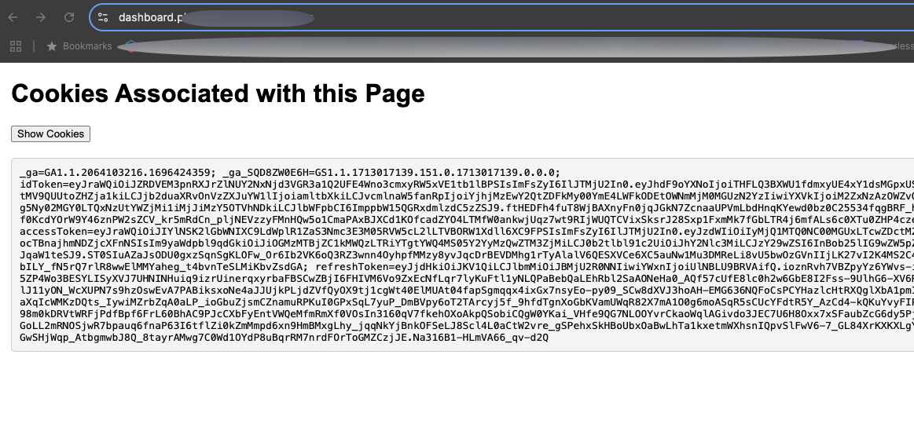
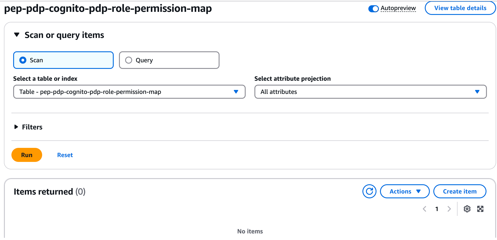

# Solution - PEP and PDP with Cognito User Pools


## Cost

As this solution is 100% serverless the cost for building and running this tutorial is very low and the cost has a direct correlation to usage. There are no components that cost by the hour, you only pay for what you use / invoke.

## Before you start

The following need to be available on your computer:

* [Install SAM Cli](https://docs.aws.amazon.com/serverless-application-model/latest/developerguide/install-sam-cli.html)

Now, Let's go build!

## Introduction

In this solution we will implement PDP (Policy Decision Point) and a PEP (Policy Enforcement Point). We will build an simple API and use Amazon API Gateway and Lambda Authorizer as the PEP. The PDP will be implemented as a separate Lambda based service. For authentication Cognito User Pools will be used. As this solution is based on Role Based Access Control (RBAC) the PDP will keep an mapping between Roles (Cognito Groups) and permissions / access to resources, in DynamoDB. 

The managed UI will be used for Cognito authentication.

Solution overview:  


Call Flow:


### Cognito callbacks

As we utilize Cognito Managed UI we need to configure some form of webapp that we can set as the callback targets for Cognito. Here we will base this of the solution [Authorization using Lambda@Edge](https://github.com/JimmyDqv/serverless-handbook/tree/main/Solutions/auth-at-cloudfront-edge)

## Deploying the solution

### How to deploy

This solution will deploy resources in two regions, eu-west-1 as our main region, and us-east-1 for resources that belong to CloudFront, such as the Lambda@Edge functions and SSL certificate.

Before you start, you will need a custom domain that can be used, through out `dashboard.example.com` will be used, this need to be changed to a custom domain you own.

### Deploy User Management (UserPool)

Start by updating [UserManagement/samconfig.yaml](UserManagement/samconfig.yaml) and add your own custom domain.
Deploy using the SAM CLI:

``` bash
sam deploy --config-env default --template-file UserManagement/template.yaml 
```

### Deploy Lambda@Edge functions

Update [Lambda@Edge/samconfig.yaml](Lambda@Edge/samconfig.yaml) and update values:

* DomainName = Shall be your own custom domain, same as for User Management
* HostedZoneId = Is the id of your Hosted Zone in Route53
* SecretArn = Is the ARN to the secret in Secrets Manager containing User Pool Client secrets, ARN can be found in output section from UserManagement stack
* SsmParametersArn = Is the wildcard ARN for the parameters in Parameter Store that contain information about UserManagement setup, arn:aws:ssm:eu-west-1:<your-account-id>:parameter/pep-pdp-cognito/*

Deploy using the SAM CLI:

``` bash
sam build
sam deploy --config-env default --template-file Lambda@Edge/template.yaml
```

NOTE! That this stack will deploy in `us-east-1` region

### Update secrets

Update the secrets needed by the Lambda@Edge functions.

Navigate to Cognito part of the console, click on your UserPool -> App Clients -> Your app Client.


Navigate to SecretsManager in the console, open your secret, click get secret value and edit the values, with the values from Cognito


### Deploy SSL Certificate

Update [SSLCertificate/samconfig.yaml](SSLCertificate/samconfig.yaml) and add your own custom domain.

Deploy using the SAM CLI:

``` bash
sam deploy --config-env default --template-file Lambda@Edge/template.yaml
```

NOTE! That this stack will deploy in `us-east-1` region

### Deploy CloudFront Distribution

Update [CloudFrontDistribution/samconfig.yaml](CloudFrontDistribution/samconfig.yaml) and update values:

* DomainName = Shall be your own custom domain, same as for User Management
* Function ARNs = Fetch the ARNs from the Lambda@Edge stack, ensure that the version is added to the end of each ARN, e.g. `:1`

Deploy using the SAM CLI:

``` bash
sam deploy --config-env default --template-file CloudFrontDistribution/template.yaml
```

Copy the simple web page to S3 bucket:

``` bash
aws s3 cp index.html s3://<bucket-name-from-distribution>/index.html
```

### Deploy Authorization (PDP)

Check the values in [AuthService/samconfig.yaml](AuthService/samconfig.yaml) and ensure they match:

Deploy using the SAM CLI:

``` bash
sam build
sam deploy --config-env default --template-file AuthService/template.yaml
```

### Deploy API

Check the values in [API/samconfig.yaml](API/samconfig.yaml) and ensure they are correct:

Deploy using the SAM CLI:

``` bash
sam build
sam deploy --config-env default --template-file API/template.yaml
```

## Test the setup

To test the PEP and PDP create a User, Roles, and Permission mapping

### Create User

Navigate to the Cognito UserPool in the Console, click on Users and click `Create User`.


Fill in the values needed, username, password, e-mail make sure to select that the e-mail is verified


Open a browser and navigate to you custom domain, you should get redirected to Cognito UI, after successful login, click `Show Cookies` to show the JWT tokens.


### Create Roles

Navigate to the Cognito UserPool in the Console, click on Groups and click `Create Group`.
Create at least one Group that can match a Role, e.g. `Admin`, `Trainer`, `Rider`


### Assign Role to user

Stay in the Groups section of Cognito UserPool, and click one of the Groups just created.
Click on `Add user to group` and select the created user.


### Create Permission mapping

navigate to DynamoDB section of the Console. Locate the permissions table and click on that.


Click on `Explore table items` in the right corner.


From this view click on `Creat item`


Create a permission mapping, by adding one or several Role - Permission mapping as below.


The solution support explicit `Allow`, implicit and explicit `Deny`. Make sure to add at least one allow for the Role assigned to the test user.

### Call API

Navigate to you favorite API tool such as Postman, Bruno or similar. Make a request to one of the API resources that the test user is `Allow` to view. Make sure to add the `access token` in the `authorization` header. Observe that a correct result is returned.


Next make an API call to one of the API resources that the test user doesn't have access to. Observe that a 403 result is returned.


## Clean up

To clean everything up delete the CloudFormation stack. This can be done either with SAM Cli command

``` bash
sam delete --stack-name TEXT
```

Or from the [AWS Console](https://eu-west-1.console.aws.amazon.com/cloudformation/home?region=eu-north-1#/stacks)
