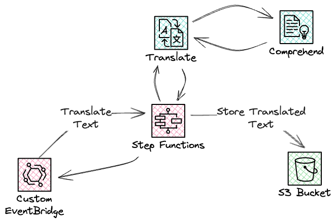
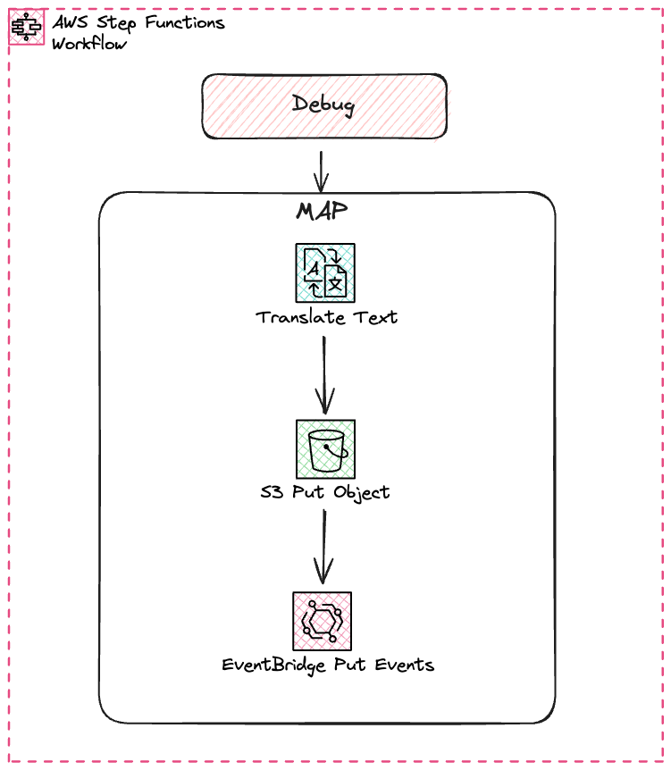
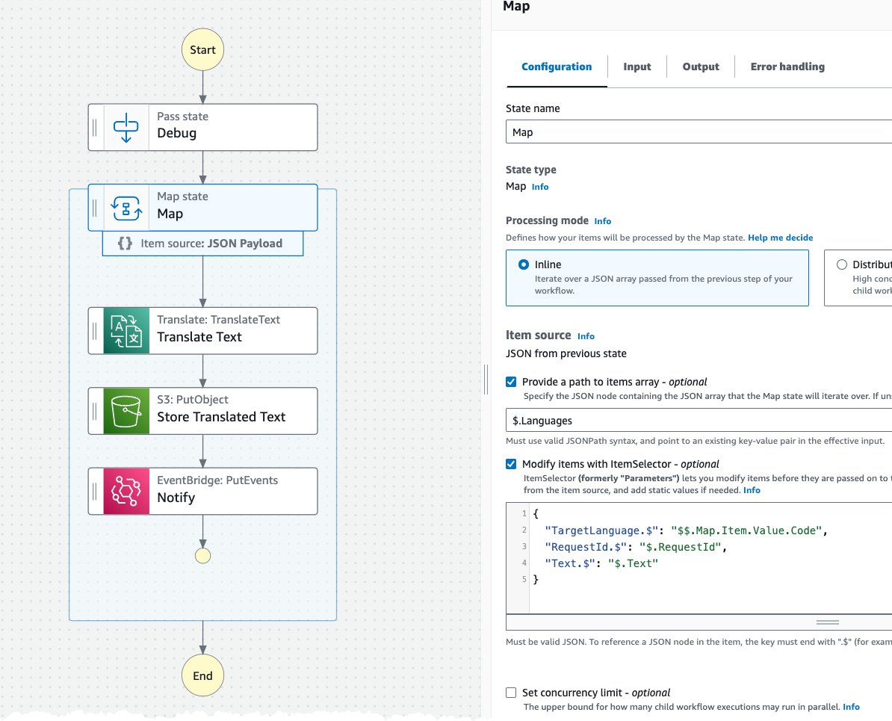

# Create Translation setup

In this part you will create the translation service using StepFunction and Translate. Translate will use Comprehend in the background to determine the source language.



## StepFunction

An event from a custom EventBridge event-bus, will start this StepFunction state-machine. The StepFunction use the Map task to iterate over the array of destination languages and translate the source into each.
The translated text will be stored in the S3 bucket, that we created in the common infrastructure, and finally post a event back to the event-bus to move to the next step in our saga pattern.

The StepFunction state-machine will look like this. The state-machine uses SDK and Optimized integrations making it possible to call AWS services directly without the need for a Lambda function.



## Create Resources

Inspect the [CloudFormation template](iac/template.yaml) to understand what is created.

Inspect the [StateMachine definition](iac/statemachine/) to understand the flow and logic, specially look at the Map task and understand the sub-flow.
Specially pay attention to the $ notation. Single $ will access the event data, and a double $$ will access the context object. [For Map state there are additional information available in the context object](https://docs.aws.amazon.com/step-functions/latest/dg/input-output-contextobject.html#contextobject-map)

Deploy the infrastructure, from the iac folder, with command:

``` bash

sam deploy --config-env default --profile YOUR-NAMED-PROFILE

```

## Inspect created resources

Navigate to StepFunctions part of the AWS Console and ensure the state-machine has been created. Select it and press edit.


In the edit view, inspect each state by selecting it. Pay attention to the config to the right.


## Test it

From the Slack channel that you have created run this command to start a translation: '/translate "Hello! How are you? This is an automatic translation." sv-SE, fr-FR'
This should, if everything is correctly setup, show a message like below.


