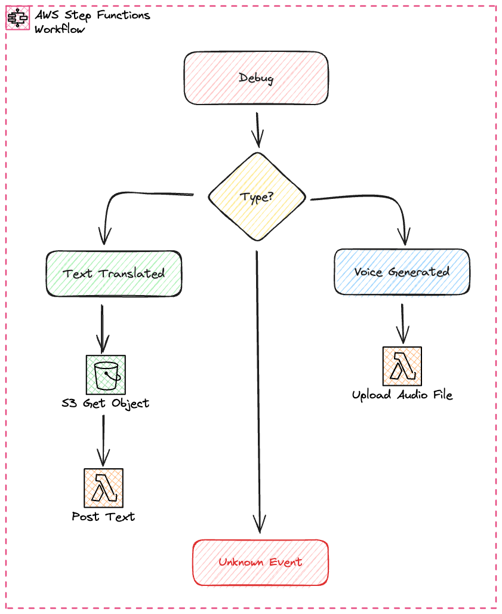
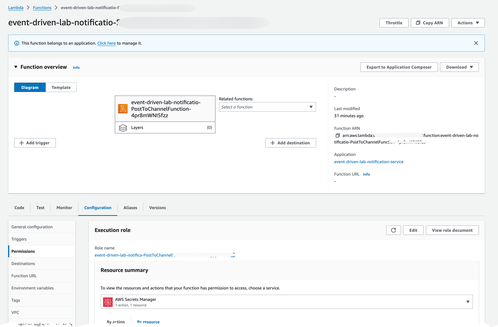

# Create Notification setup

Next part of the saga is to post back to Slack, both the translated text and the audio files.

## StepFunction

This service will be invoked by two different events, both the TextTranslated and VoiceGenerated events. The StepFunction uses a Choice state to handle both events, and then either post text or upload audio to Slack channel.



## Create Resources

Update the [Sam Config file](iac/samconfig.yaml) and add a value for SlackChannel, this is the value you should remember from [section 02](../02-create-slack-bot/)

Inspect the [CloudFormation template](iac/template.yaml) to understand what is created.

Inspect the [StateMachine definition](iac/statemachine/) to understand the flow and logic, specially look at the choice state and the two different paths to understand what is done.

Look at the code for the [Lambda functions](iac/src/) to understand the how the functions work. How do they know what channel to post to?

This service uses Python dependencies, and therefor you must first build the Lambda package with SAM, run command from iac folder:

``` bash

sam build

```

You should now see a new folder ".aws-sam" that contain the built solution. Every time you want to update you must run the build command.

Next, deploy the infrastructure, from the iac folder, with command:

``` bash

sam deploy --config-env default --profile YOUR-NAMED-PROFILE

```

## Inspect created resources

Navigate to StepFunctions part of the AWS Console and ensure the state-machine has been created. Select it and press edit.
In the edit view, inspect each state by selecting it.

Navigate to the Lambda console, investigate the functions created, the settings and permissions.


